<div align="center">


<br/>


<br/>


<h1>☁️ SACHIN TAJI</h1>

<h3>AWS Cloud Engineer • Terraform • Linux • DevOps</h3>

<p>
  <b>Cloud Infrastructure | Infrastructure as Code | Automation | Networking | Monitoring</b>
</p>

<p>
  <i>Building practical cloud solutions, automating infrastructure, and continuously improving my engineering skills.</i>
</p>

<br/>

<a href="https://github.com/sachintaji">

</a>

<a href="https://www.linkedin.com/in/sachin-taji-2b1455288/">

</a>


<br/><br/>


</div>

---

# 🧑‍💻 About Me

Hello! I'm **Sachin Taji**, an aspiring **AWS Cloud Engineer** focused on cloud infrastructure, Infrastructure as Code, Linux administration, and DevOps automation.

I enjoy understanding how cloud services work together to create reliable and scalable infrastructure. My learning is based on hands-on implementation, troubleshooting, and building practical projects.

I am currently developing my skills in AWS, Terraform, Linux, Jenkins, Docker, Git, and cloud networking.


### AWS Topics I Practice

| Category | Topics |
|---|---|
| Compute | EC2, AMI, EBS, Auto Scaling |
| Networking | VPC, CIDR, Subnets, Route Tables |
| Connectivity | IGW, NAT Gateway, Security Groups |
| Availability | Availability Zones, ALB, Auto Scaling |
| Storage | S3, EBS |
| Database | RDS MySQL |
| Security | IAM, Roles, Policies |
| DNS | Route 53 |
| Monitoring | CloudWatch, SNS |

---

# 🏗️ TERRAFORM — INFRASTRUCTURE AS CODE

<div align="center">


<h3>Define Infrastructure. Automate Deployment. Manage Changes.</h3>

</div>

Terraform is one of my main tools for practicing Infrastructure as Code. I use Terraform concepts to define cloud resources in configuration files and understand how infrastructure can be created consistently.


### Scenarios I Practice

| Scenario | Area |
|---|---|
| EC2 cannot be reached | Security Groups / Networking |
| Private instance cannot access the internet | NAT / Route Tables |
| Application is not reachable | Ports / Services / ALB |
| RDS connection fails | Networking / Credentials |
| Terraform resource fails | Configuration / Dependencies |
| Jenkins pipeline fails | Workspace / Pipeline / Permissions |
| Docker application is not accessible | Port Mapping / Container |
| Linux service is down | `systemctl` / Logs |
| Disk space is full | `df` / `du` / Log Management |
| DNS is not resolving | Route 53 / DNS |

---

# 🛠️ COMPLETE TECHNOLOGY STACK

<div align="center">

## ☁️ CLOUD & INFRASTRUCTURE


## 🔄 DEVOPS & AUTOMATION


## 🐧 SYSTEMS & WEB


## 🗄️ DATABASE & DEVELOPMENT


</div>

---

# 📋 SKILLS MATRIX

| Skill Category | Technologies |
|---|---|
| Cloud Platform | AWS |
| Compute | EC2, Lambda |
| Networking | VPC, Subnets, IGW, NAT, ALB |
| Infrastructure as Code | Terraform |
| Operating Systems | Linux, Ubuntu, Amazon Linux |
| CI/CD | Jenkins |
| Containers | Docker |
| Version Control | Git, GitHub |
| Monitoring | CloudWatch, SNS |
| Database | MySQL, RDS |
| DNS | Route 53 |
| Web Servers | Nginx, Apache Tomcat |
| Programming Foundation | Java, HTML, CSS |
| Automation | Terraform, Jenkins |

---


<!-- GitHub Statistics -->

<h2>📊 GitHub Statistics</h2>

<div align="center">




</div>

# 🐍 CONTRIBUTION ACTIVITY

<div align="center">


</div>

---

# 🎯 CAREER OBJECTIVE

I'm working toward opportunities in:

<div align="center">

### ☁️ AWS Cloud Engineer

### 🏗️ Cloud Infrastructure Engineer

### 🔄 DevOps Engineer

### ⚙️ Infrastructure Automation

</div>

My goal is to develop strong practical skills in designing, deploying, securing, monitoring, and automating cloud infrastructure.

I want to contribute to real-world cloud environments while continuously improving my technical knowledge and problem-solving abilities.

---

# 🌱 MY LEARNING PHILOSOPHY

```text
         Learn the Concept
                │
                ▼
         Build the Project
                │
                ▼
        Face the Problem
                │
                ▼
          Find the Cause
                │
                ▼
          Fix the Issue
                │
                ▼
       Understand the Solution
                │
                ▼
          Document It
                │
                ▼
             Improve
```

> **"Good infrastructure is not just created — it is understood, tested, monitored, and continuously improved."**

---

# 🤝 LET'S CONNECT

<div align="center">

<a href="https://github.com/sachintaji">

</a>

<a href="https://www.linkedin.com/in/sachin-taji-2b1455288/">

</a>

<br/><br/>

### ☁️ BUILD • AUTOMATE • DEPLOY • MONITOR • IMPROVE

<br/>

**AWS** • **Terraform** • **Linux** • **Git** • **Jenkins** • **Docker**

<br/>

<i>Thanks for visiting my profile! 🚀</i>

</div>
